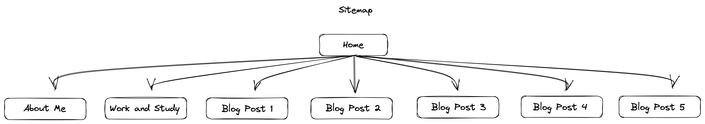
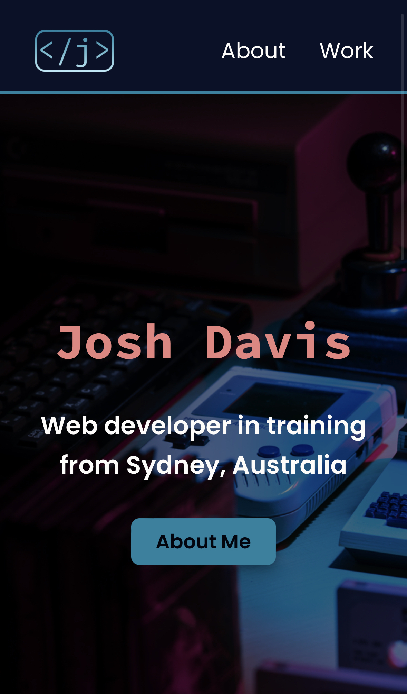
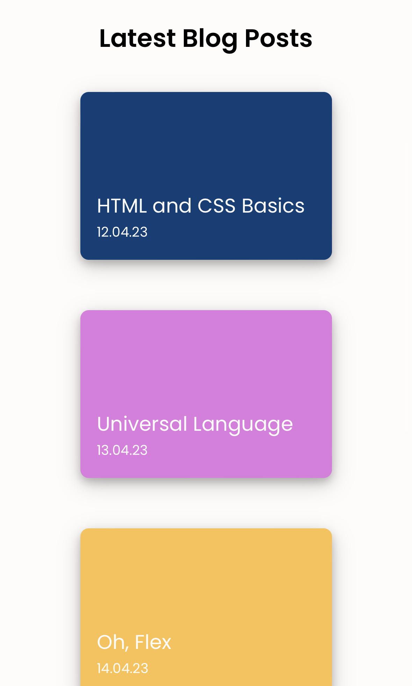
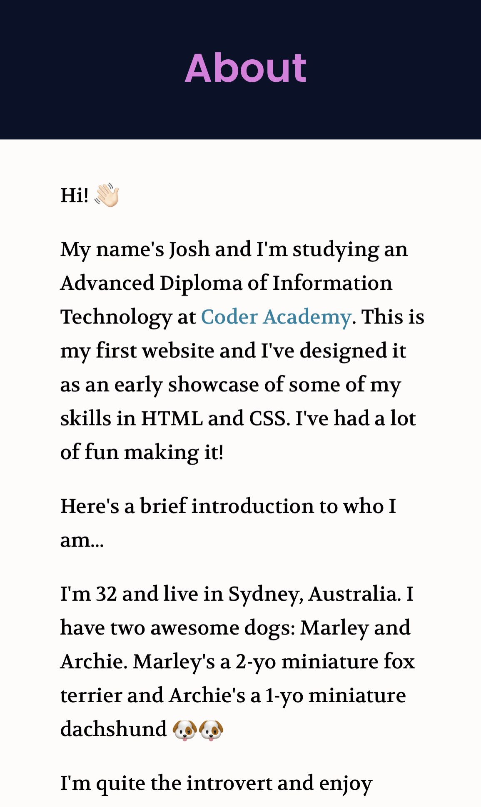
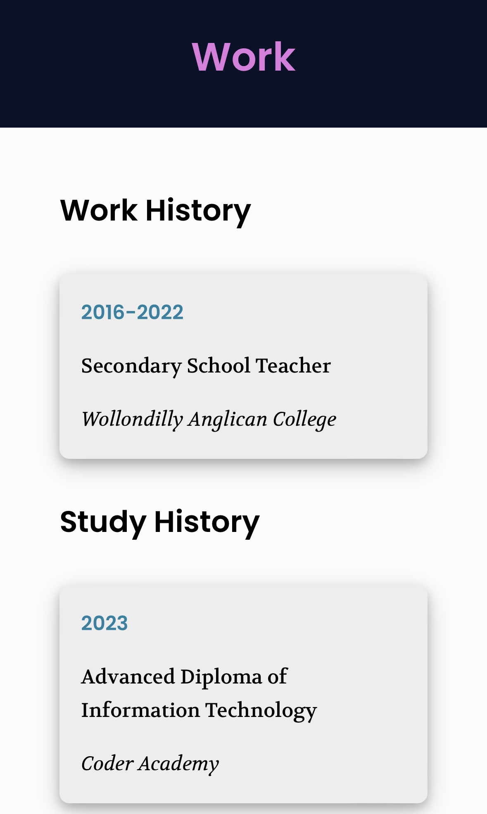
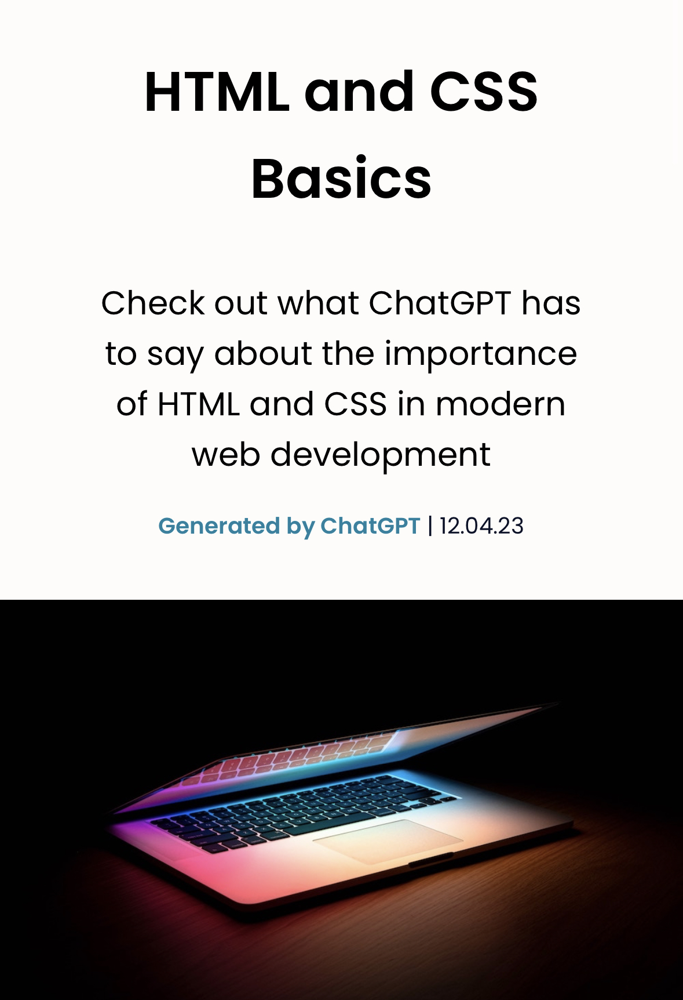

# T1A2 Portfolio

**Name:** Joshua Davis

**Student Number:** 14209

| Assessment Component | Link |
| --- | --- |
| Published portfolio website | https://joshdavis.vercel.app/index.html |
| GitHub repository | https://github.com/joshuadavis1990/portfolio |
| Video presentation link | https://youtu.be/HbtRGwunT7M |

## Description of website

### Purpose

The purpose of my portfolio website is to:

1. Provide an online environment where I can easily showcase my skills and knowledge in my journey to becoming a full-stack web developer.
1. Demonstrate my HTML and CSS skills to prospective employers and/or clients.
1. Highlight my personality, skills and interests through written and visual content and design.
1. Publish an online blog where I have the ability to share industry-relevant information and research.
1. Provide my contact details and social media links for prospective employers and/or clients.
1. Present all of the above information and components in a beautiful, minimal and responsive manner.

### Functionality and features

- The site was built for mobile first and uses mutliple media queries to present content in a *responsive and fluid manner* for tablet (portrait and landscape orientations) and desktop.
- Each of the pages share a clear and common theme.
- The visual design of the website is professional. There is no visual clutter and all components have been designed to fulfil a function.
- The site caters to accessibiity by ensuring screen readers can easily navigate the semantic HTML. Additionally, clear contrast is used with font colours to enable readability.
- The home page is functional by providing clear and direct access to the main blog posts of the site, as well as easy site navigation in the header.
- The sitemap is clear and logical to navigate.
- Links and buttons are generously sized and clearly styled.
- A beautiful serif font-family has been used for displaying blog content, in contrast to the popular "Poppins" sans-serif font used everywhere else.

### Sitemap

### Screenshots

### Target audience

The target audience for my portfolio website is an employer looking to engage a developer and/or IT professional. The website assumes that this person has technical knowledge relating to IT, software development/coding, programming languages and development stacks, as well as high expectations of professionalism and a positive work ethic.

### Tech stack

- HTML 5 was used to markup and structure the main content on each page of the website.
- CSS 3 was used to style the HTML documents.
- Vercel (https://vercel.com) was used to deploy the website.